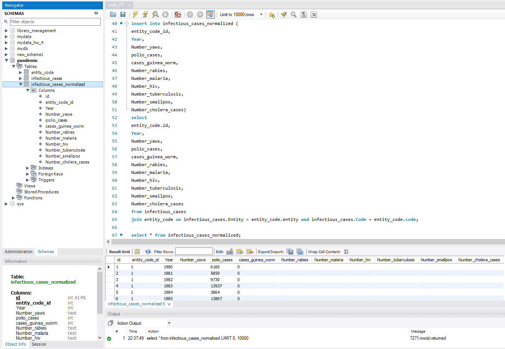

# Relational Databases. Final project

1. Завантажте дані:
   Створіть схему pandemic у базі даних за допомогою SQL-команди.
   Оберіть її як схему за замовчуванням за допомогою SQL-команди.
   Імпортуйте дані за допомогою Import wizard так, як ви вже робили це у темі 3.
   infectious_cases.csv

2. Нормалізуйте таблицю infectious_cases. Збережіть у цій же схемі дві таблиці з нормалізованими даними.

3. Проаналізуйте дані:
   Для кожної унікальної комбінації Entity та Code або їх id порахуйте середнє, мінімальне, максимальне значення та суму для атрибута Number_rabies.
   Врахуйте, що атрибут Number_rabies може містити порожні значення '' — вам попередньо необхідно їх відфільтрувати.
   Результат відсортуйте за порахованим середнім значенням у порядку спадання.
   Оберіть тільки 10 рядків для виведення на екран.

4. Побудуйте колонку різниці в роках.
   Для оригінальної або нормованої таблиці для колонки Year побудуйте з використанням вбудованих SQL-функцій:
   атрибут, що створює дату першого січня відповідного року,
   атрибут, що дорівнює поточній даті,
   атрибут, що дорівнює різниці в роках двох вищезгаданих колонок.

5. Побудуйте власну функцію.
   Створіть і використайте функцію, що будує такий же атрибут, як і в попередньому завданні:
   функція має приймати на вхід значення року,
   а повертати різницю в роках між поточною датою та датою,
   створеною з атрибута року (1996 рік → '1996-01-01').

